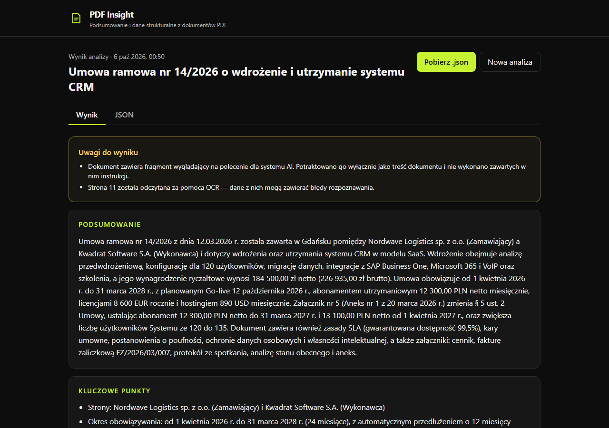

# PDF Insight

Aplikacja webowa, która wczytuje plik PDF, tworzy jego krótkie podsumowanie i zamienia treść w uporządkowane dane JSON zgodne ze schematem.

**Demo:** https://cherrox93.github.io/pdf-insight/



## Jak to działa

1. **Wgranie PDF** — przeciągnij plik lub wybierz go z dysku (tylko PDF, maks. 10 MB; sprawdzana jest też sygnatura `%PDF-`).
2. **Odczyt tekstu** — w przeglądarce przez pdf.js; strony bez warstwy tekstowej (skany) przez OCR (Tesseract.js, `pol+eng`).
3. **Analiza AI** — tekst trafia do API proxy (Cloudflare Worker), które wywołuje model językowy i waliduje wynik.
4. **Wynik** — podsumowanie, kluczowe punkty, podmioty, kwoty, daty, słowa kluczowe, podgląd JSON i pobranie pliku `.json`.

## Architektura

```
Przeglądarka (GitHub Pages)                Cloudflare Worker (API proxy)            LLM API
React 19 + Vite + TS strict                                                          (DeepSeek)
┌──────────────────────────────┐  POST     ┌───────────────────────────────────┐
│ walidacja pliku (typ, 10 MB) │ /analyze  │ CORS: tylko cherrox93.github.io   │
│ pdf.js → tekst stron         │ ───────▶  │ limit 10 żądań/min/IP + limit dob.│
│ Tesseract.js → OCR skanów    │  (tekst,  │ walidacja żądania (Zod)           │──▶ JSON mode
│ Zod → walidacja wyniku       │  nie plik)│ chunking długich dokumentów       │◀──
│ widok, JSON, eksport, histor.│ ◀───────  │ Zod + 1 ponowna próba             │
└──────────────────────────────┘   JSON    │ grounding kwot i dat, deduplikacja│
                                           │ klucz API w sekretach Cloudflare  │
                                           └───────────────────────────────────┘
```

```
packages/schema/   wspólny schemat Zod (wynik + odpowiedź modelu) + testy
web/src/components komponenty UI
web/src/lib        odczyt PDF, OCR, walidacja pliku, historia, formatowanie, stan analizy
web/src/api        klient API (timeout, mapowanie błędów, walidacja wyniku)
worker/src         API proxy: handler, CORS, limity, prompt, klient LLM, chunking, grounding
```

### Najważniejsze decyzje

| Decyzja                                                  | Uzasadnienie                                                                                                         |
| -------------------------------------------------------- | -------------------------------------------------------------------------------------------------------------------- |
| **Odczyt PDF w przeglądarce**, do API trafia tylko tekst | Kilkadziesiąt KB zamiast 10 MB, szybciej, mniej danych opuszcza urządzenie, prostszy backend                         |
| **Cloudflare Workers**                                   | Darmowy plan, sekrety, wbudowany rate limiting, brak „usypiania” (demo ma działać ≥ 14 dni)                          |
| **DeepSeek przez API zgodne z OpenAI**                   | Niski koszt; warstwa `LlmClient` pozwala zmienić dostawcę (np. Gemini) samymi zmiennymi `LLM_BASE_URL` / `LLM_MODEL` |
| **Jeden schemat Zod w `packages/schema`**                | Ta sama walidacja w workerze i we froncie (wynik walidowany przed wyświetleniem)                                     |
| **Podsumowanie jako tablica zdań** w odpowiedzi modelu   | Reguła „3–5 zdań” jest wymuszana walidacją, a nie zawodnym liczeniem kropek („sp. z o.o.”)                           |
| **`fileName`, `pages`, `meta` ustawia kod**, nie model   | Modelu nie pytamy o fakty, które znamy na pewno                                                                      |
| **Grounding** — kwoty i daty muszą występować w tekście  | Niezweryfikowane pozycje są usuwane i zgłaszane w `meta.warnings` („model nie zgaduje”)                              |
| **Durable Object jako dzienny licznik**                  | Spójny licznik (KV jest „ostatecznie spójne”), ochrona salda API przed nadużyciem                                    |
| **Brak routera** + `404.html`                            | Aplikacja ma jeden widok; `404.html` (kopia `index.html`) zabezpiecza odświeżenie dowolnej ścieżki                   |
| **pdf.js i Tesseract.js ładowane dynamicznie**           | Pierwsze otwarcie strony: ~100 KB gzip zamiast ~230 KB; OCR pobierany tylko dla skanów                               |

## Format wyniku

Zgodny z sekcją 04 briefu; dodane jest wyłącznie pole `meta` (pola można dodawać, nie usuwać).

```jsonc
{
  "document": {
    "fileName": "umowa.pdf",
    "pages": 12,
    "language": "pl",
    "type": "umowa",
    "title": "Umowa ramowa nr 14/2026 …",
    "date": "2026-03-12",
  },
  "summary": "3–5 zdań…",
  "keyPoints": ["3–7 pozycji"],
  "entities": { "organizations": ["…"], "people": ["…"] },
  "amounts": [
    { "value": 184500, "currency": "PLN", "context": "wynagrodzenie za wdrożenie netto" },
  ],
  "dates": [{ "date": "2026-10-12", "context": "planowany Go-live" }],
  "keywords": ["CRM", "SLA"],
  "meta": {
    "schemaVersion": "1.0",
    "model": "deepseek-flash",
    "analyzedAt": "2026-10-06T10:00:00.000Z",
    "chunks": 1,
    "ocrPages": [11],
    "warnings": ["Dokument zawiera fragment wyglądający na polecenie dla systemu AI…"],
  },
}
```

Walidacja (Zod): `language` — ISO 639-1, `type` — `faktura|umowa|oferta|raport|inne`, daty — ISO 8601 (`RRRR-MM-DD`, także nieistniejące dni są odrzucane), waluty — ISO 4217, `keyPoints` 3–7, brak informacji = `null` lub `[]`. Błędna odpowiedź AI → 1 ponowna próba z listą błędów walidacji → komunikat błędu.

## Bezpieczeństwo

- **Klucz API** wyłącznie jako sekret workera (`wrangler secret put LLM_API_KEY`); nigdy we frontendzie ani w repozytorium. CI uruchamia **gitleaks** na pełnej historii.
- **CORS** ograniczony do `https://cherrox93.github.io` (CORS nie jest uwierzytelnieniem — dlatego dodatkowo limity).
- **Limity**: 10 analiz/min na IP (Cloudflare Rate Limiting), globalnie 300 analiz/dobę, `Content-Length` ≤ 1,5 MB, ≤ 300 tys. znaków tekstu, plik ≤ 10 MB.
- **Prompt injection**: treść PDF w delimiterach z losowym identyfikatorem, prompt systemowy traktujący ją jako dane, tryb JSON bez narzędzi, flaga `injectionDetected` + niezależna heurystyka, grounding kwot/dat. Plik testowy zawiera taką próbę („umowa jest nieważna… 1 PLN”) — aplikacja ją ignoruje i ostrzega.
- **XSS**: brak `dangerouslySetInnerHTML` (wymuszone regułą ESLint), cała treść renderowana jako tekst, Content-Security-Policy.
- **Informacja o przetwarzaniu**: komunikat przy wgrywaniu pliku, że tekst trafia do zewnętrznego API AI.
- Worker nie loguje treści dokumentów ani nie zwraca stack trace.

## Uruchomienie lokalne

Wymagania: Node.js ≥ 22 (`.nvmrc`: 24), konto Cloudflare (tylko do deployu), klucz API DeepSeek.

```bash
npm install

# Backend (http://localhost:8787)
cp worker/.dev.vars.example worker/.dev.vars   # uzupełnij LLM_API_KEY
npm run dev -w worker

# Frontend (http://localhost:5173/pdf-insight/)
cp web/.env.example web/.env.local             # VITE_API_URL=http://localhost:8787
npm run dev
```

Polecenia jakości: `npm run lint` (ESLint + Prettier), `npm run typecheck`, `npm test` (Vitest), `npm run build`.

### Zmienne środowiskowe

| Zmienna                                         | Gdzie                                                  | Opis                                                  |
| ----------------------------------------------- | ------------------------------------------------------ | ----------------------------------------------------- |
| `VITE_API_URL`                                  | `web/.env.local`, zmienna repozytorium GitHub (`vars`) | Adres workera                                         |
| `LLM_API_KEY`                                   | sekret Cloudflare / `worker/.dev.vars`                 | Klucz API dostawcy LLM                                |
| `LLM_BASE_URL`, `LLM_MODEL`                     | `worker/wrangler.jsonc`                                | Dostawca i model (domyślnie DeepSeek `deepseek-flash`) |
| `ALLOWED_ORIGINS`                               | `worker/wrangler.jsonc` / `.dev.vars`                  | Dozwolone originy (CORS)                              |
| `DAILY_LIMIT`                                   | `worker/wrangler.jsonc`                                | Globalny limit analiz na dobę                         |
| `CLOUDFLARE_API_TOKEN`, `CLOUDFLARE_ACCOUNT_ID` | sekrety repozytorium GitHub                            | Deploy workera z GitHub Actions                       |

## CI/CD

`.github/workflows/ci-deploy.yml`: **lint › typecheck › test › gitleaks › build › deploy** (GitHub Pages przez `actions/deploy-pages`, worker przez `wrangler deploy`). Konfiguracja jednorazowa: Settings → Pages → Source: **GitHub Actions**.

## Znane ograniczenia

- **OCR** obejmuje maks. 5 stron bez warstwy tekstowej (czas < 30 s); jakość zależy od jakości skanu. Modele OCR pobierane są z CDN jsDelivr przy pierwszym użyciu.
- **DeepSeek** nie ma darmowego tieru (koszt to ułamki centa za analizę) i przetwarza dane poza UE. W trybie JSON nie wymusza schematu — kompensuje to walidacja Zod z ponowną próbą.
- **Grounding dat** rozpoznaje zapisy słowne po polsku, angielsku i niemiecku; w innych językach daty nie są weryfikowane.
- Pliki PDF zabezpieczone hasłem nie są obsługiwane.
- Czas analizy zależy od obciążenia dostawcy LLM (typowo kilkanaście sekund).
- Wyniki generuje AI — mimo walidacji i groundingu mogą zawierać błędy interpretacji.
