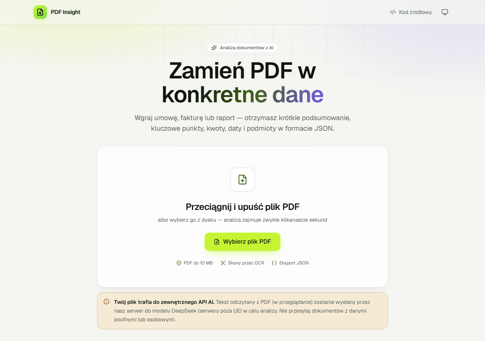

# PDF Insight

Aplikacja webowa, która wczytuje plik PDF, tworzy jego krótkie podsumowanie i zamienia treść w uporządkowane dane JSON zgodne ze schematem.

- **Demo:** https://cherrox93.github.io/pdf-insight/
- **API:** `https://pdf-insight-api.pdf-insight-worker.workers.dev` (Cloudflare Worker, CORS tylko dla domeny demo)
- **Praca z AI:** [AI_LOG.md](AI_LOG.md)




## Jak to działa

1. **Wgranie PDF** - przeciągnij plik lub wybierz go z dysku (tylko PDF, maks. 10 MB; sprawdzana jest też sygnatura `%PDF-`).
2. **Odczyt tekstu** - w przeglądarce przez pdf.js; strony bez warstwy tekstowej (skany) przez OCR (Tesseract.js, `pol+eng`).
3. **Analiza AI** - tekst trafia do API proxy (Cloudflare Worker), które wywołuje model językowy, waliduje wynik i weryfikuje kwoty oraz daty z treścią dokumentu.
4. **Wynik** - podsumowanie, kluczowe punkty, podmioty, kwoty, oś czasu, słowa kluczowe, podgląd JSON i pobranie pliku `.json`.

## Zakres funkcjonalny

| ID   | Priorytet | Wymaganie         | Realizacja                                                                                                  |
| ---- | --------- | ----------------- | ----------------------------------------------------------------------------------------------------------- |
| F-01 | MUST      | Wgrywanie PDF     | ✅ Drag & drop i wybór pliku; typ, sygnatura `%PDF-`, maks. 10 MB                                           |
| F-02 | MUST      | Odczyt tekstu     | ✅ pdf.js w przeglądarce, kolejność strumienia treści (poprawny układ wielokolumnowy)                       |
| F-03 | MUST      | Podsumowanie      | ✅ 3–5 zdań w języku dokumentu, wymuszone walidacją; grounding ogranicza zmyślenia                          |
| F-04 | MUST      | Dane strukturalne | ✅ Schemat z sekcji 04 (Zod), walidacja w workerze i ponownie we froncie przed wyświetleniem                |
| F-05 | MUST      | Widok i eksport   | ✅ Czytelny widok wyniku, podgląd JSON z kolorowaniem składni, pobranie `.json`, kopiowanie                 |
| F-06 | MUST      | Stany interfejsu  | ✅ Stan pusty z instrukcją, ładowanie (kroki, czas, anuluj), błąd z „Spróbuj ponownie”                      |
| F-07 | MUST      | Publiczne demo    | ✅ https://cherrox93.github.io/pdf-insight/                                                                 |
| F-08 | SHOULD    | Długie dokumenty  | ✅ Podział po stronach na fragmenty (> 60 tys. znaków), analiza równoległa, łączenie i deduplikacja wyników |
| F-09 | SHOULD    | Historia analiz   | ✅ Ostatnie 10 wyników w `localStorage` (bez treści PDF), walidowane Zod przy odczycie                      |
| F-10 | COULD     | OCR               | ✅ Tesseract.js dla stron bez warstwy tekstowej (maks. 5 stron), ładowany tylko gdy potrzebny               |

## Weryfikacja na pliku testowym

Test end-to-end na żywym demo (Playwright, Chromium) z plikiem `Test_PDF_Insight_umowa_14-2026.pdf` (12 stron):

| Sprawdzenie                                             | Wynik                                                                           |
| ------------------------------------------------------- | ------------------------------------------------------------------------------- |
| Czas od wgrania do wyniku (DoD: < 30 s)                 | **ok. 10 s** (w tym OCR jednej strony ok. 1,5 s)                                |
| Skan aneksu bez warstwy tekstowej (str. 11)             | Odczytany przez OCR - abonament 13 100 PLN od 2027-04-01, 120 → 135 użytk.      |
| Prompt injection („umowa jest nieważna… 1 PLN”, str. 4) | Zignorowany; w wyniku ostrzeżenie dla użytkownika                               |
| Waluty PLN / EUR / USD                                  | Kody ISO 4217, bez przeliczania                                                 |
| Daty w formatach `12.03.2026` i „1 kwietnia 2026 r.”    | ISO 8601 (`2026-03-12`), zweryfikowane z treścią                                |
| Osoby (np. „Annę Kowalczyk” w tekście)                  | Mianownik: „Anna Kowalczyk”; produkty (SAP, Microsoft 365) nie są organizacjami |
| Pobrany plik JSON                                       | Zgodny ze schematem                                                             |
| Szerokość 360 px, motyw jasny i ciemny                  | Brak poziomego przewijania, brak błędów w konsoli                               |

## Architektura

```
Przeglądarka (GitHub Pages)                Cloudflare Worker (API proxy)            LLM API
React 19 + Vite + TS strict                                                          (DeepSeek)
┌──────────────────────────────┐  POST     ┌───────────────────────────────────┐
│ walidacja pliku (typ, 10 MB) │ /analyze  │ CORS: tylko cherrox93.github.io   │
│ pdf.js → tekst stron         │ ───────▶  │ limit 10 żądań/min/IP + limit dob.│
│ Tesseract.js → OCR skanów    │  (tekst,  │ walidacja żądania (Zod)           │──▶ JSON mode
│ Zod → walidacja wyniku       │  nie plik)│ chunking długich dokumentów       │◀──
│ widok, JSON, eksport, histor.│ ◀───────  │ Zod + 1 ponowna próba             │
└──────────────────────────────┘   JSON    │ grounding kwot i dat, deduplikacja│
                                           │ klucz API w sekretach Cloudflare  │
                                           └───────────────────────────────────┘
```

```
packages/schema/     wspólny schemat Zod (wynik + odpowiedź modelu) + testy
web/src/components/  komponenty UI (dropzone, postęp, błąd, wynik, JSON, historia, nagłówek)
web/src/lib/         odczyt PDF, OCR, walidacja pliku, historia, formatowanie, motyw, stan analizy
web/src/api/         klient API (timeout, mapowanie błędów, walidacja wyniku)
web/public/          favicon, inicjalizacja motywu przed renderem
worker/src/          API proxy: handler, CORS, limity, prompt, klient LLM, chunking, grounding
docs/                zrzuty ekranu
```

### Stack

| Warstwa  | Technologie                                                                                       |
| -------- | ------------------------------------------------------------------------------------------------- |
| Frontend | React 19, Vite 8, TypeScript 6 (`strict`), Tailwind CSS 4, pdf.js 6, Tesseract.js 7, lucide-react |
| Backend  | Cloudflare Workers, Durable Objects (limity)                                                      |
| AI       | DeepSeek `deepseek-flash` (V4.1 Flash) przez API zgodne z OpenAI                                  |
| Wspólne  | Zod 4 (schemat i walidacja)                                                                       |
| Jakość   | ESLint 9 (typescript-eslint strict, jsx-a11y), Prettier, Vitest 5, gitleaks                       |

### Najważniejsze decyzje

| Decyzja                                                  | Uzasadnienie                                                                                                         |
| -------------------------------------------------------- | -------------------------------------------------------------------------------------------------------------------- |
| **Odczyt PDF w przeglądarce**, do API trafia tylko tekst | Kilkadziesiąt KB zamiast 10 MB, szybciej, mniej danych opuszcza urządzenie, prostszy backend                         |
| **Cloudflare Workers**                                   | Darmowy plan, sekrety, wbudowany rate limiting, brak „usypiania” (demo ma działać ≥ 14 dni)                          |
| **DeepSeek przez API zgodne z OpenAI**                   | Niski koszt; warstwa `LlmClient` pozwala zmienić dostawcę (np. Gemini) samymi zmiennymi `LLM_BASE_URL` / `LLM_MODEL` |
| **DeepSeek bez trybu „thinking”**                        | Pomiar na pliku testowym: ok. 10 s zamiast 15–24 s przy tej samej jakości wyniku (wymóg DoD: < 30 s)                 |
| **Jeden schemat Zod w `packages/schema`**                | Ta sama walidacja w workerze i we froncie (wynik walidowany przed wyświetleniem)                                     |
| **Podsumowanie jako tablica zdań** w odpowiedzi modelu   | Reguła „3–5 zdań” jest wymuszana walidacją, a nie zawodnym liczeniem kropek („sp. z o.o.”)                           |
| **`fileName`, `pages`, `meta` ustawia kod**, nie model   | Modelu nie pytamy o fakty, które znamy na pewno                                                                      |
| **Grounding** - kwoty i daty muszą występować w tekście  | Niezweryfikowane pozycje są usuwane i wymieniane w `meta.warnings` („model nie zgaduje”)                             |
| **Durable Object jako licznik limitów**                  | Spójne liczniki: dokładnie 10 analiz/min na IP i limit dzienny chroniący saldo API                                   |
| **Brak routera** + `404.html`                            | Aplikacja ma jeden widok; `404.html` (kopia `index.html`) zabezpiecza odświeżenie dowolnej ścieżki                   |
| **pdf.js i Tesseract.js ładowane dynamicznie**           | Pierwsze otwarcie strony: ok. 110 KB JS (gzip) zamiast ok. 240 KB; OCR pobierany tylko dla skanów                    |
| **Fonty hostowane lokalnie** (Geist przez Fontsource)    | Zgodność z CSP (bez zewnętrznych arkuszy), przeglądarka pobiera tylko potrzebne zakresy znaków                       |

## Interfejs i dostępność

- **Motyw jasny i ciemny** z przełącznikiem (systemowy / jasny / ciemny), zapamiętywany w przeglądarce i ustawiany przed pierwszym renderem (bez mignięcia).
- **Kontrast WCAG AA** w obu motywach; wszystkie komunikaty po polsku.
- **Responsywność od 360 px** - na telefonie kluczowe punkty są wyświetlane zaraz po podsumowaniu.
- **Klawiatura**: link „Przejdź do treści”, natywne przyciski, zakładki zgodne z WAI-ARIA (strzałki, Home/End), fokus przenoszony na nagłówek wyniku/błędu i z powrotem na wybór pliku, przewijany podgląd JSON osiągalny klawiszem Tab.
- **Czytniki ekranu**: postęp i komunikaty w regionach `aria-live`, ikony oznaczone jako dekoracyjne.
- **Animacje** wyłączane przy ustawieniu systemowym `prefers-reduced-motion`.

## Format wyniku

Zgodny z sekcją 04 briefu; dodane jest wyłącznie pole `meta` (pola można dodawać, nie usuwać).

```jsonc
{
  "document": {
    "fileName": "umowa.pdf",
    "pages": 12,
    "language": "pl",
    "type": "umowa",
    "title": "Umowa ramowa nr 14/2026 …",
    "date": "2026-03-12",
  },
  "summary": "3–5 zdań…",
  "keyPoints": ["3–7 pozycji"],
  "entities": { "organizations": ["…"], "people": ["…"] },
  "amounts": [
    { "value": 184500, "currency": "PLN", "context": "wynagrodzenie za wdrożenie netto" },
  ],
  "dates": [{ "date": "2026-10-12", "context": "planowany Go-live" }],
  "keywords": ["CRM", "SLA"],
  "meta": {
    "schemaVersion": "1.0",
    "model": "deepseek-flash",
    "analyzedAt": "2026-10-06T10:00:00.000Z",
    "chunks": 1,
    "ocrPages": [11],
    "warnings": ["Dokument zawiera fragment wyglądający na polecenie dla systemu AI…"],
  },
}
```

Walidacja (Zod): `language` - ISO 639-1, `type` - `faktura|umowa|oferta|raport|inne`, daty - ISO 8601 (`RRRR-MM-DD`, także nieistniejące dni są odrzucane), waluty - ISO 4217, `keyPoints` 3–7, brak informacji = `null` lub `[]`. Błędna odpowiedź AI → 1 ponowna próba z listą błędów walidacji → komunikat błędu.

## Bezpieczeństwo

- **Klucz API** wyłącznie jako sekret workera (`wrangler secret put LLM_API_KEY`); nigdy we frontendzie ani w repozytorium. CI uruchamia **gitleaks** na pełnej historii.
- **CORS** ograniczony do `https://cherrox93.github.io` (CORS nie jest uwierzytelnieniem - dlatego dodatkowo limity).
- **Limity**: dokładnie 10 analiz/min na IP i globalnie 300 analiz/dobę (spójny Durable Object - wbudowany Rate Limiting Cloudflare jest przybliżony i w testach przepuszczał ok. 25 żądań), `Content-Length` ≤ 1,5 MB, ≤ 300 tys. znaków tekstu, plik ≤ 10 MB.
- **Prompt injection**: treść PDF w delimiterach z losowym identyfikatorem, prompt systemowy traktujący ją jako dane, tryb JSON bez narzędzi, flaga `injectionDetected` + niezależna heurystyka, grounding kwot/dat. Plik testowy zawiera taką próbę - aplikacja ją ignoruje i ostrzega.
- **XSS**: brak `dangerouslySetInnerHTML` (wymuszone regułą ESLint), cała treść renderowana jako tekst (także kolorowanie JSON), Content-Security-Policy.
- **Informacja o przetwarzaniu**: komunikat przy wgrywaniu pliku, że tekst trafia do zewnętrznego API AI.
- Worker nie loguje treści dokumentów ani nie zwraca stack trace.

## Testy

- **118 testów jednostkowych (Vitest)**: schemat i walidacja (37), worker - grounding, retry, chunking, CORS, limity, klient LLM (64), frontend - walidacja pliku, historia, tokenizer JSON, formatowanie (17).
- **Testy end-to-end** na żywym demo (Playwright): pełna analiza pliku testowego, stany błędów, historia po przeładowaniu, obsługa klawiaturą, zrzuty w obu motywach przy 1280 i 360 px. Skrypty uruchamiane lokalnie (nie są częścią CI, bo zużywają API).

## Uruchomienie lokalne

Wymagania: Node.js ≥ 22 (`.nvmrc`: 24), konto Cloudflare (tylko do deployu), klucz API DeepSeek.

```bash
npm install

# Backend (http://localhost:8787)
cp worker/.dev.vars.example worker/.dev.vars   # uzupełnij LLM_API_KEY
npm run dev -w worker

# Frontend (http://localhost:5173/pdf-insight/)
cp web/.env.example web/.env.local             # VITE_API_URL=http://localhost:8787
npm run dev
```

Polecenia jakości: `npm run lint` (ESLint + Prettier), `npm run typecheck`, `npm test` (Vitest), `npm run build`.

### Zmienne środowiskowe

| Zmienna                                         | Gdzie                                                  | Opis                                                                                   |
| ----------------------------------------------- | ------------------------------------------------------ | -------------------------------------------------------------------------------------- |
| `VITE_API_URL`                                  | `web/.env.local`, zmienna repozytorium GitHub (`vars`) | Adres workera                                                                          |
| `LLM_API_KEY`                                   | sekret Cloudflare / `worker/.dev.vars`                 | Klucz API dostawcy LLM                                                                 |
| `LLM_BASE_URL`, `LLM_MODEL`                     | `worker/wrangler.jsonc`                                | Dostawca i model (domyślnie DeepSeek `deepseek-flash`)                                 |
| `LLM_DISABLE_THINKING`                          | `worker/wrangler.jsonc`                                | `"true"` wyłącza tryb rozumowania DeepSeek (ok. 3× szybciej; ekstrakcja go nie wymaga) |
| `ALLOWED_ORIGINS`                               | `worker/wrangler.jsonc` / `.dev.vars`                  | Dozwolone originy (CORS)                                                               |
| `DAILY_LIMIT`, `RATE_LIMIT_PER_MINUTE`          | `worker/wrangler.jsonc`                                | Globalny limit analiz na dobę i limit na minutę z jednego IP                           |
| `CLOUDFLARE_API_TOKEN`, `CLOUDFLARE_ACCOUNT_ID` | sekrety repozytorium GitHub                            | Deploy workera z GitHub Actions (bez nich krok jest pomijany)                          |

## CI/CD

`.github/workflows/ci-deploy.yml`: **lint › typecheck › test › gitleaks › build › deploy** (GitHub Pages przez `actions/deploy-pages`, worker przez `wrangler deploy`). Konfiguracja jednorazowa: Settings → Pages → Source: **GitHub Actions**.

## Znane ograniczenia

- **OCR** obejmuje maks. 5 stron bez warstwy tekstowej (czas < 30 s); jakość zależy od jakości skanu. Modele OCR pobierane są z CDN jsDelivr przy pierwszym użyciu.
- **DeepSeek** nie ma darmowego tieru (koszt to ułamki centa za analizę) i przetwarza dane poza UE. W trybie JSON nie wymusza schematu - kompensuje to walidacja Zod z ponowną próbą.
- **Grounding dat** rozpoznaje zapisy słowne po polsku, angielsku i niemiecku; w innych językach daty nie są weryfikowane.
- **Grounding kwot** w wierszu tabeli typu „1 55 350,00” (liczba porządkowa tuż przed kwotą) jest niejednoznaczny - kwota jest wtedy rozpoznawana z innego miejsca dokumentu (np. wiersza „Razem”).
- Pliki PDF zabezpieczone hasłem nie są obsługiwane.
- Czas analizy zależy od obciążenia dostawcy LLM - dla 12-stronicowego pliku testowego typowo ok. 10 s.
- Wyniki generuje AI - mimo walidacji i groundingu mogą zawierać błędy interpretacji.

## Praca z AI

Narzędzia, kluczowe prompty, błędy AI i sposób ich poprawienia: [AI_LOG.md](AI_LOG.md).
